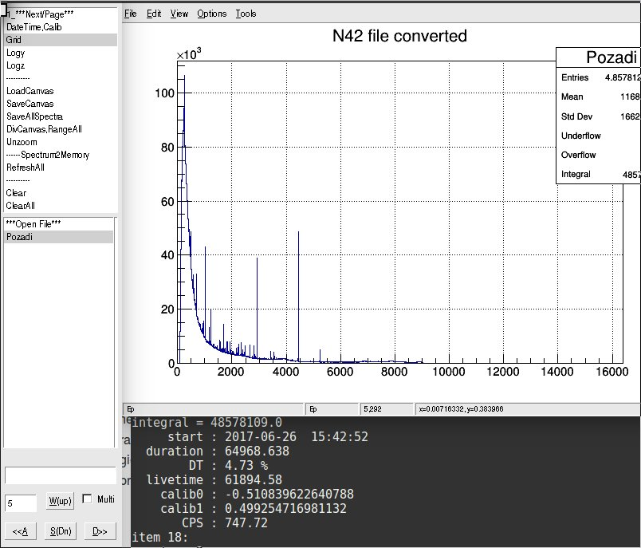
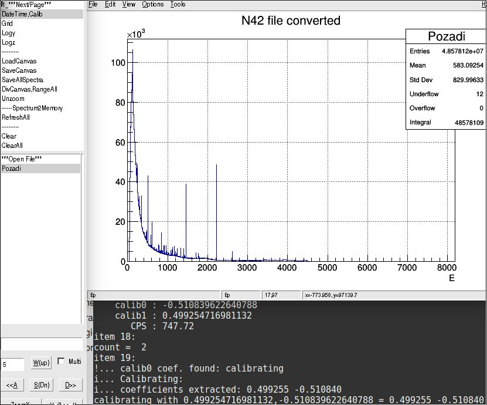
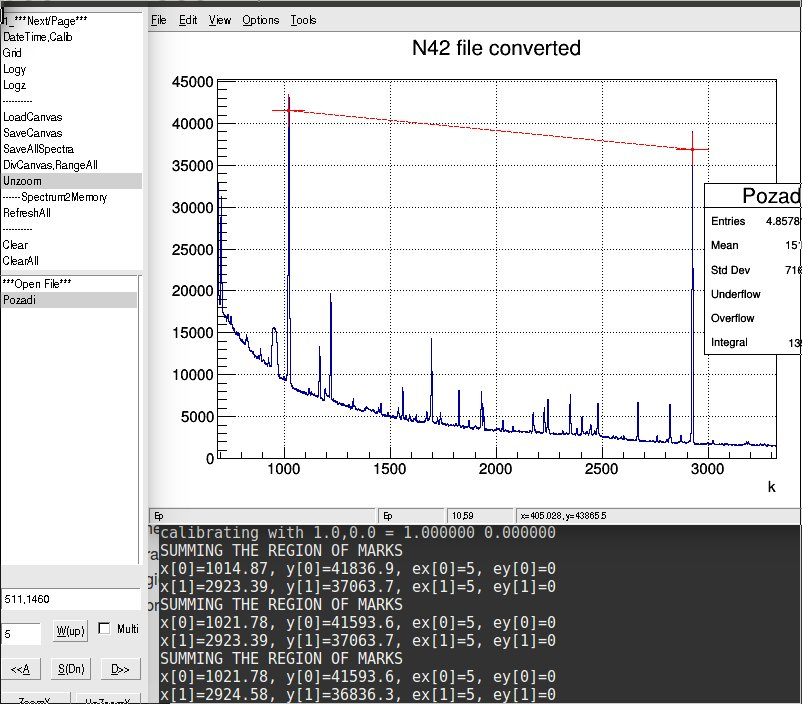
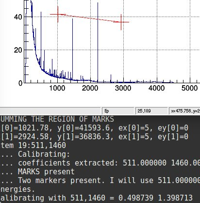

Calibrations
=================

Calibration is a shared menu item with `DateTime,Calib`. Depending
on the context - calibration is used, not DateTime display. The
 calibration is USED WHEN:

* TH1 seems **already** calibrated => calibration is then UNDONE:
  * `GetXaxis()->GetXmin()` (histogram start) is not ZERO
  * bins are not exactly 1.0 wide
* TH1 has a `TNamed` object in `GetListOfFunctions()` of name *calib0*
--- in this case, even if large txtfield is empty ---
*calib1,calib0* is newly inserted and used.
*  The large txtfield is not empty, there should be two - comma separated - values. They **could** be either :
  * calibration coefficients *a,b*
  * Energies corresponding two MARKS (made by middle mouse button) - calibration coefficients are calculated after in this case.

Internal TNamed coef calibration
-------------------------------

*spectrum with calib0,calib1 defined was leaded* 

*spectrum is calibrated based on TNamed (see Energy label)*

MARKS calibration
------------------------

*MARKS are precisely set, 511,1460 are the peak energies (see k label)*

*Energies were converted to calibration coefficients, spectrum *x-axis* is in **E** and MARKS are badly placed as a result*
