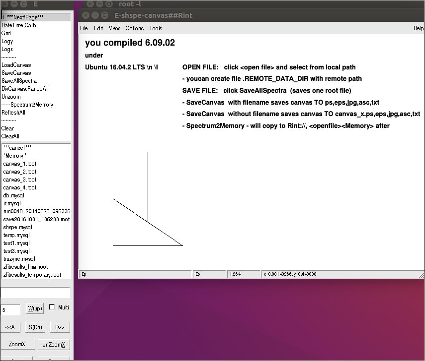
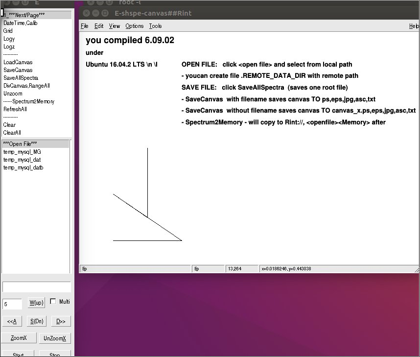
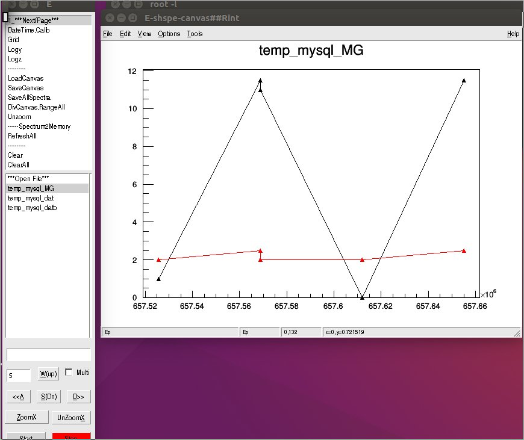
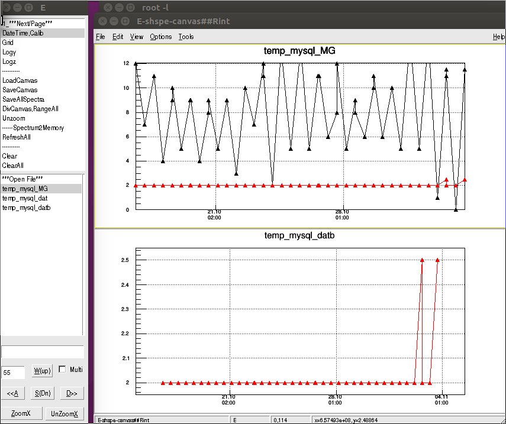

Open file
===========

To keep the system very simple **Shspe** can open local files:

- root
- specialy formated **mysql** database data via `sqmylite` code
- special formated **sqlite3** database data via `sqmylite` code
- `cuts.root` are always automatically loaded

In addition, it can open files in one - read-only - **remote folder**.
This folder
can be defined in `.REMOTE_DATA_DIR` file in local directory.

The idea is to open files with spectra localy and make
an analysis and - be able to also open experimental runs
with *TTrees* that reside at a remote folder.


**Shspe** *can also open a root file on start `shspe("file.root")*
Open .root
--------------

- Histograms are loaded in the list **TH1** and **TH2**
- Cuts are loaded in the list

After openning a **TH1F** - details of the histogram are displayed
e.g.:
```
File OPENED  <n42_test.root> (OFaction)
========== h1 =====
entries  = 2608914.6
mean     =    2048.5
RMS      =     891.8
integral = 2608914.6
     start : 01-01-2017
  duration : 1234
        DT : 4.5%
       CPS : 12001.5

```

The part from `start :` on are attached `TNamed` functions
- `TH1F->GetListOfFunctions()->ls()` name and title. Keywords
will be defined (like for calibration coefficients).

Open MySQL
------------

File named `abc.mysql` must contain three lines of text
- server name or IP
- user
- password

The database is named `test` and the table is named `abc`. Then
`mysqlite` can be called from **Shspe**.

To display of **TGraphs** from MySQL table - **TMultiGraph** is used.
There are single graphs (a,b,c...h) to display and there is
also TMultiGraph *..._MG* that displays all graphs together.

There is a default number of last points to display `5`. The number
of points can be changed in the field `sigma`.


*root and mysql files can be opened*


*temp.mysql was opened*


*temp_mysql_MG was displayed*


*MG and datb are shown*
