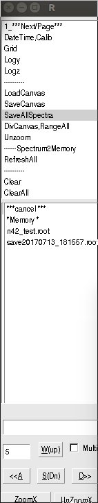

Saving files
===============

Two types of save are possible:

- `SaveAllSpe` - everytime saves all spectra with a unique date and time mark.
No naming possibility. Useful at the end of the run.

*SaveAllSpectra was pressed, result is on disk*

- `SaveCanvas` - two save modes:

	1. With a filename in a *big text field* it saves
	**all spectra present on TCanvas and TPads** to `filename.root`
	and makes `jpg, eps, ps` pictures for print and `asc,txt` spectra
	for later analysis.

	2. Without a filename given, it attempts to save TCanvas to `canvas_1.root`
    file (and .jpg,.eps files) and the next time to `canvas_2.root` etc.
	These files are used to **recall** the page (replacing old histograms
	with those actual) by `LoadCanvas` menu item.

