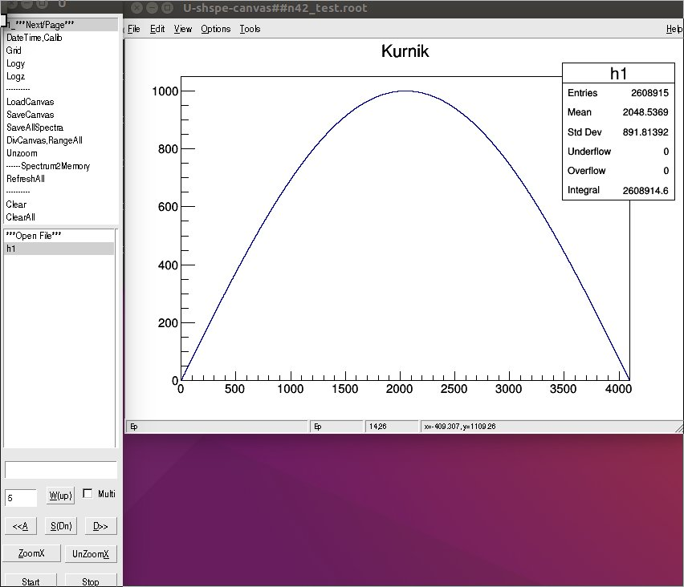
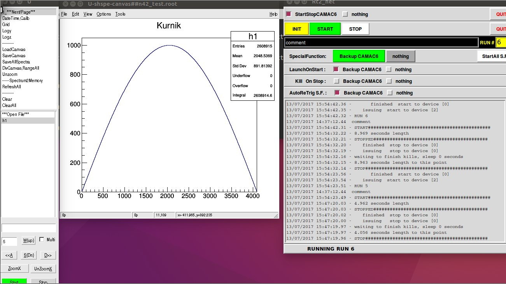
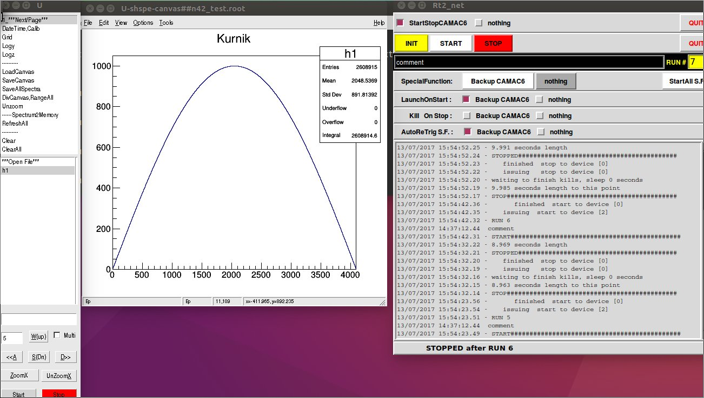

Start stop mode
==================

**Shspe** can cooperate with `rt2.pl` code
tat is used to start/stop data acquisistion
in VME module.

We read `~/rt2.PID` file with the actual rt2.pl
process PID and we can send SIGUSR1 and SIGUSR2
signals to this PID to Start and Stop respectively.

To use this mode, run inside root CINT:
```
shspe(1)
```





